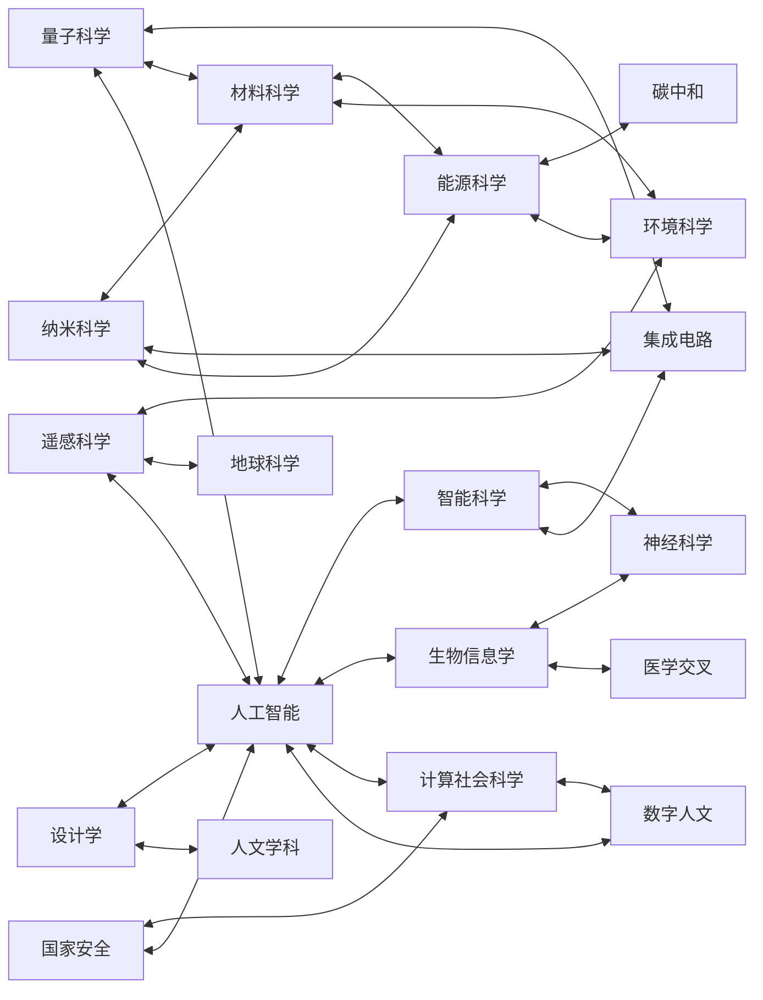

# 交叉学科关系图谱

## 1. ASCII图：交叉学科与传统学科关系

```
                           传统学科层
    ┌─────────────────────────────────────────────────────────────┐
    │  数学  物理  化学  生物  计算机  工程  社科  人文  医学  地学  │
    └──┬─────┬─────┬─────┬──────┬─────┬─────┬─────┬─────┬─────┬──┘
       │     │     │     │      │     │     │     │     │     │
       ▼     ▼     ▼     ▼      ▼     ▼     ▼     ▼     ▼     ▼
    ┌─────────────────────────────────────────────────────────────┐
    │                      交叉学科层                              │
    │                                                             │
    │  ┌──────────┐  ┌──────────┐  ┌──────────┐  ┌──────────┐    │
    │  │人工智能  │  │智能科学  │  │集成电路  │  │量子科学  │    │
    │  └────┬─────┘  └────┬─────┘  └────┬─────┘  └────┬─────┘    │
    │       │             │             │             │          │
    │  ┌────┴─────┐  ┌────┴─────┐  ┌────┴─────┐  ┌────┴─────┐    │
    │  │神经科学  │  │生物信息  │  │纳米科学  │  │材料科学  │    │
    │  └────┬─────┘  └────┬─────┘  └────┬─────┘  └────┬─────┘    │
    │       │             │             │             │          │
    │  ┌────┴─────┐  ┌────┴─────┐  ┌────┴─────┐  ┌────┴─────┐    │
    │  │遥感科学  │  │环境科学  │  │能源科学  │  │碳中和    │    │
    │  └────┬─────┘  └────┬─────┘  └────┬─────┘  └────┬─────┘    │
    │       │             │             │             │          │
    │  ┌────┴─────┐  ┌────┴─────┐  ┌────┴─────┐  ┌────┴─────┐    │
    │  │设计学    │  │国家安全  │  │计算社科  │  │数字人文  │    │
    │  └──────────┘  └──────────┘  └──────────┘  └──────────┘    │
    │                                                             │
    └─────────────────────────────────────────────────────────────┘
```

## 2. Mermaid图：交叉学科与传统学科关系

```mermaid
graph TB
    subgraph 传统学科
        M[数学]
        P[物理学]
        C[化学]
        B[生物学]
        CS[计算机科学]
        E[工程学]
        SS[社会科学]
        H[人文学科]
        MED[医学]
        ES[地球科学]
    end
    
    subgraph 交叉学科
        AI[人工智能]
        IS[智能科学与技术]
        IC[集成电路科学与工程]
        QS[量子科学与技术]
        NS[神经科学]
        BI[生物信息学]
        NM[纳米科学与工程]
        MS[材料科学]
        RS[遥感科学与技术]
        ENV[环境科学与工程]
        EN[能源科学]
        CN[碳中和科学与工程]
        DS[设计学]
        NSec[国家安全学]
        CSS[计算社会科学]
        DH[数字人文]
    end
    
    M --> AI
    M --> QS
    M --> IS
    M --> CSS
    
    P --> QS
    P --> IC
    P --> NM
    P --> MS
    P --> EN
    
    C --> NM
    C --> MS
    C --> ENV
    C --> EN
    
    B --> BI
    B --> NS
    B --> ENV
    B --> MS
    
    CS --> AI
    CS --> IS
    CS --> BI
    CS --> CSS
    CS --> DH
    
    E --> IC
    E --> NM
    E --> RS
    E --> ENV
    E --> EN
    
    SS --> NSec
    SS --> CSS
    SS --> DS
    
    H --> DH
    H --> DS
    
    MED --> NS
    MED --> BI
    
    ES --> RS
    ES --> ENV
    ES --> EN
```



## 3. Mermaid图：交叉学科之间的相互关系



## 4. 交叉学科与父学科对照表

| 交叉学科 | 主要父学科 | 次要父学科 | 核心交叉领域 |
|---------|-----------|-----------|-------------|
| 集成电路科学与工程 | 电子工程、物理学 | 材料科学、计算机科学 | 半导体器件、微电子工艺 |
| 国家安全学 | 政治学、法学 | 国际关系、情报学 | 安全战略、风险管控 |
| 设计学 | 艺术学、工程学 | 心理学、计算机科学 | 人机交互、产品创新 |
| 遥感科学与技术 | 地球科学、物理学 | 计算机科学、测绘学 | 对地观测、空间信息 |
| 智能科学与技术 | 计算机科学、数学 | 认知科学、控制工程 | 智能系统、机器学习 |
| 纳米科学与工程 | 物理学、化学 | 材料科学、生物学 | 纳米材料、分子器件 |
| 碳中和科学与工程 | 环境科学、能源科学 | 化学工程、经济学 | 碳捕获、清洁能源 |
| 人工智能 | 计算机科学、数学 | 统计学、神经科学 | 深度学习、自然语言处理 |
| 生物信息学 | 生物学、计算机科学 | 统计学、数学 | 基因组学、蛋白质组学 |
| 神经科学 | 生物学、医学 | 心理学、物理学 | 脑机制、认知功能 |
| 材料科学 | 物理学、化学 | 工程学、生物学 | 新材料、性能优化 |
| 环境科学与工程 | 环境科学、化学工程 | 生物学、地球科学 | 污染控制、生态修复 |
| 能源科学 | 物理学、工程学 | 化学、材料科学 | 新能源、储能技术 |
| 量子科学与技术 | 物理学、数学 | 计算机科学、材料科学 | 量子计算、量子通信 |
| 计算社会科学 | 社会科学、计算机科学 | 统计学、数学 | 社会网络、行为建模 |
| 数字人文 | 人文学科、计算机科学 | 语言学、历史学 | 文本挖掘、数字遗产 |

## 5. 交叉强度分析

### 交叉强度等级定义

| 等级 | 强度值 | 描述 | 典型特征 |
|-----|-------|------|---------|
| ★★★★★ | 5 | 极强融合 | 学科边界完全模糊，形成全新方法论体系 |
| ★★★★☆ | 4 | 强融合 | 多学科深度整合，产生独特研究范式 |
| ★★★☆☆ | 3 | 中等融合 | 学科间有明确交叉点，各自保持独立性 |
| ★★☆☆☆ | 2 | 弱融合 | 工具或方法的借用，核心领域相对独立 |
| ★☆☆☆☆ | 1 | 微弱融合 | 仅在边缘领域有接触点 |

### 各交叉学科交叉强度

| 交叉学科 | 交叉强度 | 说明 |
|---------|---------|------|
| 人工智能 | ★★★★★ | 数学、计算机、神经科学、统计学深度融合 |
| 生物信息学 | ★★★★★ | 生物学与计算机科学完全整合，无法分离 |
| 神经科学 | ★★★★★ | 生物学、医学、心理学、物理学高度统一 |
| 纳米科学与工程 | ★★★★☆ | 物理、化学、材料在纳米尺度深度交叉 |
| 量子科学与技术 | ★★★★☆ | 物理原理与工程应用的紧密结合 |
| 智能科学与技术 | ★★★★☆ | 计算机与认知科学的深度融合 |
| 材料科学 | ★★★★☆ | 物理、化学、工程的有机结合 |
| 环境科学与工程 | ★★★☆☆ | 科学认知与工程应用的结合 |
| 集成电路科学与工程 | ★★★☆☆ | 以电子工程为核心的多学科应用 |
| 能源科学 | ★★★☆☆ | 物理、化学、工程的交叉应用 |
| 遥感科学与技术 | ★★★☆☆ | 地球科学与技术的结合 |
| 碳中和科学与工程 | ★★★☆☆ | 环境与能源的综合应用 |
| 计算社会科学 | ★★★★☆ | 传统社科与计算方法的革命性结合 |
| 数字人文 | ★★★☆☆ | 人文研究方法的数字化转型 |
| 设计学 | ★★★☆☆ | 艺术与工程的平衡融合 |
| 国家安全学 | ★★☆☆☆ | 以社会科学为主的多学科支撑 |

## 6. 交叉学科聚类分析

```
┌────────────────────────────────────────────────────────────┐
│                    交叉学科聚类图谱                          │
├────────────────────────────────────────────────────────────┤
│                                                            │
│   ┌─────────────── 技术驱动型 ───────────────┐            │
│   │  人工智能 ←→ 智能科学 ←→ 集成电路       │            │
│   │      ↓           ↓           ↓          │            │
│   │  量子科学 ←→ 纳米科学 ←→ 材料科学       │            │
│   └─────────────────────────────────────────┘            │
│                        ↓                                  │
│   ┌─────────────── 应用导向型 ───────────────┐            │
│   │  遥感科学 ←→ 环境科学 ←→ 碳中和         │            │
│   │                ↓                         │            │
│   │           能源科学                       │            │
│   └─────────────────────────────────────────┘            │
│                        ↓                                  │
│   ┌─────────────── 生命健康型 ───────────────┐            │
│   │  生物信息 ←→ 神经科学                    │            │
│   └─────────────────────────────────────────┘            │
│                        ↓                                  │
│   ┌─────────────── 社会人文型 ───────────────┐            │
│   │  计算社科 ←→ 数字人文 ←→ 设计学         │            │
│   │      ↓                                   │            │
│   │  国家安全                                │            │
│   └─────────────────────────────────────────┘            │
│                                                            │
└────────────────────────────────────────────────────────────┘
```

## 7. 发展趋势与演进路径

### 7.1 技术演进路径

```
物理学 ──────┬──→ 量子科学 ────→ 量子智能
             │
             └──→ 纳米科学 ────→ 智能材料

计算机科学 ──┬──→ 人工智能 ────→ 通用人工智能
             │
             └──→ 计算社科 ────→ 数字社会

生物学 ──────┬──→ 生物信息 ────→ 合成生物学
             │
             └──→ 神经科学 ────→ 类脑智能
```

### 7.2 应用融合路径

```
基础研究层：量子科学、纳米科学、神经科学
     ↓
技术转化层：人工智能、集成电路、材料科学
     ↓
应用服务层：遥感科学、环境科学、能源科学
     ↓
社会影响层：计算社科、数字人文、国家安全学
```

## 8. 关键交叉节点

在交叉学科网络中，以下学科起到关键连接作用：

1. **人工智能**：连接技术层与应用层的核心枢纽
2. **材料科学**：连接基础研究与工程应用的重要桥梁
3. **计算机科学**：几乎所有交叉学科的方法论基础
4. **物理学**：自然科学交叉的核心源头

---

*本关系图谱展示了交叉学科之间及其与传统学科的复杂网络关系，反映了现代科学发展的融合趋势。*
