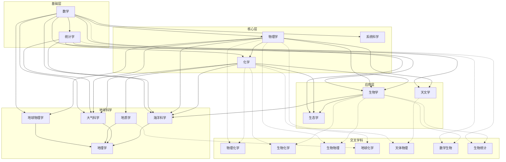

# 理学学科关系图

## 一、学科层级结构图

```
                    ┌─────────────────────────────────────┐
                    │            【基础学科】              │
                    │                                     │
                    │    ┌──────┐         ┌──────┐       │
                    │    │ 数学 │         │统计学│       │
                    │    └──┬───┘         └──┬───┘       │
                    └───────┼────────────────┼───────────┘
                            │                │
                            ▼                ▼
                    ┌─────────────────────────────────────┐
                    │          【核心学科】                │
                    │                                     │
                    │    ┌──────┐   ┌──────┐   ┌──────┐  │
                    │    │物理学│   │ 化学 │   │系统科│  │
                    │    └──┬───┘   └──┬───┘   └──┬───┘  │
                    └───────┼──────────┼──────────┼───────┘
                            │          │          │
              ┌─────────────┼──────────┼──────────┼─────────┐
              │             │          │          │         │
              ▼             ▼          ▼          ▼         ▼
    ┌─────────────┐  ┌──────────┐ ┌──────┐ ┌──────┐ ┌──────┐
    │   天文学    │  │地球科学群│ │生物学│ │生态学│ │交叉 │
    └─────────────┘  └──────────┘ └──────┘ └──────┘ │领域 │
                        │  │  │                    └──────┘
                        ▼  ▼  ▼
                  ┌────────────────┐
                  │地质学 地球物理 │
                  │大气科 海洋科学 │
                  │    地理学     │
                  └────────────────┘
```

## 二、Mermaid 依赖关系图



## 三、学科依赖关系说明

### 基础学科

| 学科 | 说明 | 被依赖学科 |
|------|------|-----------|
| **数学** | 所有理学的语言和工具 | 物理学、化学、天文学、地球物理学、大气科学、海洋科学、系统科学、统计学 |
| **统计学** | 数据分析与推断的方法论 | 生物学、生态学、大气科学、海洋科学、医学研究、社会科学 |

### 核心学科

| 学科 | 基础要求 | 应用领域 |
|------|----------|----------|
| **物理学** | 数学（微积分、线性代数、微分方程） | 天文学、地球物理学、材料科学、工程技术 |
| **化学** | 物理学（量子力学、热力学）、数学 | 生物学、药学、材料科学、环境科学 |
| **系统科学** | 数学、物理学、计算机科学 | 复杂系统研究、控制论、信息论 |

### 应用学科

| 学科 | 基础要求 | 特点 |
|------|----------|------|
| **天文学** | 物理学、数学 | 研究宇宙中天体的性质和演化 |
| **生物学** | 化学、物理学、数学 | 研究生命现象和生命活动规律 |
| **生态学** | 生物学、化学、统计学 | 研究生物与环境的关系 |

### 地球科学群

| 学科 | 基础要求 | 研究对象 |
|------|----------|----------|
| **地理学** | 物理学、化学、生物学 | 地球表层自然和人文现象 |
| **地质学** | 物理学、化学 | 地球物质组成和演化历史 |
| **地球物理学** | 物理学、数学 | 地球内部结构和物理性质 |
| **大气科学** | 物理学、数学、化学 | 大气现象和气候系统 |
| **海洋科学** | 物理学、化学、生物学 | 海洋的物理、化学、生物特性 |

## 四、主要交叉领域

### 1. 物理与化学交叉

```
┌────────────┬─────────────────────────────────────┐
│  交叉领域   │            研究内容                 │
├────────────┼─────────────────────────────────────┤
│ 物理化学   │ 化学热力学、电化学、反应动力学      │
│ 量子化学   │ 化学键理论、分子结构计算            │
│ 材料物理   │ 新材料的物理性质研究                │
│ 化学物理   │ 分子光谱、分子动力学                │
└────────────┴─────────────────────────────────────┘
```

### 2. 化学与生物交叉

```
┌────────────┬─────────────────────────────────────┐
│  交叉领域   │            研究内容                 │
├────────────┼─────────────────────────────────────┤
│ 生物化学   │ 生物分子的结构与功能                │
│ 化学生物学 │ 化学工具研究生物系统                │
│ 分子生物学 │ 基因和蛋白质的化学基础              │
│ 生物有机化学│ 生物系统中的有机反应               │
└────────────┴─────────────────────────────────────┘
```

### 3. 物理与生物交叉

```
┌────────────┬─────────────────────────────────────┐
│  交叉领域   │            研究内容                 │
├────────────┼─────────────────────────────────────┤
│ 生物物理   │ 生物大分子的物理性质                │
│ 神经物理   │ 神经系统的物理机制                  │
│ 计算生物物理│ 蛋白质折叠模拟                     │
│ 辐射生物学 │ 辐射对生物的影响                    │
└────────────┴─────────────────────────────────────┘
```

### 4. 地球科学交叉

```
┌────────────┬─────────────────────────────────────┐
│  交叉领域   │            研究内容                 │
├────────────┼─────────────────────────────────────┤
│ 地球化学   │ 地球物质的化学组成和演化            │
│ 生物地球化学│ 生物参与的地球化学循环             │
│ 海洋化学   │ 海水化学成分和反应                  │
│ 大气化学   │ 大气成分和化学反应                  │
└────────────┴─────────────────────────────────────┘
```

### 5. 数学与其他学科交叉

```
┌────────────┬─────────────────────────────────────┐
│  交叉领域   │            研究内容                 │
├────────────┼─────────────────────────────────────┤
│ 数学生物学 │ 生物学中的数学模型                  │
│ 生物统计学 │ 生物数据分析方法                    │
│ 计算物理   │ 物理问题的数值模拟                  │
│ 计算化学   │ 分子结构和反应的计算                │
│ 数学地质学 │ 地质过程的数学建模                  │
└────────────┴─────────────────────────────────────┘
```

## 五、学科知识链

```
┌─────────────────────────────────────────────────────────────────┐
│                      学科知识传递链                              │
├─────────────────────────────────────────────────────────────────┤
│                                                                 │
│   数学 ──▶ 物理学 ──▶ 化学 ──▶ 生物学 ──▶ 生态学               │
│    │        │          │         │          │                  │
│    │        │          │         │          │                  │
│    │        ▼          ▼         ▼          │                  │
│    │    天文学    地球化学   生物化学       │                  │
│    │        │          │         │          │                  │
│    │        ▼          ▼         │          │                  │
│    │    天体物理  地质学/地球物理 │          │                  │
│    │                        │     │          │                  │
│    │                        ▼     ▼          │                  │
│    │                      海洋科学 ◀─────────┘                  │
│    │                           │                                │
│    ▼                           ▼                                │
│   统计学 ─────────────────▶ 大气科学                             │
│                                                                 │
└─────────────────────────────────────────────────────────────────┘
```

## 六、学习建议路径

### 理论研究路径
```
数学基础（微积分、线性代数）→ 物理学 → 选定专业方向
                                    ↓
                         ┌─────────┼─────────┐
                         ↓         ↓         ↓
                      天文学    理论物理   地球物理
```

### 实验研究路径
```
数学 + 物理基础 → 化学 → 生物学/生态学
                      ↓
              ┌───────┼───────┐
              ↓       ↓       ↓
          生物化学  材料科学  环境科学
```

### 地球科学路径
```
物理 + 化学 + 数学基础 → 地球科学群
                           ↓
            ┌──────────────┼──────────────┐
            ↓              ↓              ↓
         地质学        大气科学       海洋科学
```

### 交叉学科路径
```
数学 + 物理 + 化学 + 生物 → 系统科学
                            ↓
                  复杂系统建模与仿真
```

## 七、学科关系矩阵

|       | 数学 | 物理 | 化学 | 生物 | 天文 | 地理 | 地质 | 地球物理 | 大气 | 海洋 | 生态 | 统计 | 系统科学 |
|-------|------|------|------|------|------|------|------|----------|------|------|------|------|----------|
| 数学  | -    | ⬆️   | ⬆️   |      | ⬆️   |      |      | ⬆️       | ⬆️   | ⬆️   |      | ⬆️   | ⬆️       |
| 物理  | ⬇️   | -    | ⬆️   | ⬆️   | ⬆️   |      |      | ⬆️       | ⬆️   | ⬆️   |      |      | ⬆️       |
| 化学  | ⬇️   | ⬇️   | -    | ⬆️   |      |      | ⬆️   |          | ⬆️   | ⬆️   | ⬆️   |      |          |
| 生物  |      | ⬇️   | ⬇️   | -    |      |      |      |          |      | ⬆️   | ⬆️   | ⬇️   | ⬆️       |
| 天文  | ⬇️   | ⬇️   |      |      | -    |      |      | ⬇️       |      |      |      |      |          |
| 地理  |      |      |      |      |      | -    | ⬇️   | ⬇️       | ⬇️   | ⬇️   | ⬇️   |      |          |
| 地质  |      |      | ⬇️   |      |      | ⬆️   | -    | ⬇️       |      | ⬇️   |      |      |          |
| 地球物理| ⬇️ | ⬇️   |      |      | ⬆️   | ⬆️   | ⬆️   | -        | ⬇️   | ⬇️   |      |      |          |
| 大气  | ⬇️   | ⬇️   | ⬇️   |      |      | ⬆️   |      | ⬆️       | -    | ⬇️   |      | ⬇️   |          |
| 海洋  | ⬇️   | ⬇️   | ⬇️   | ⬇️   |      | ⬆️   | ⬆️   | ⬆️       | ⬆️   | -    | ⬇️   | ⬇️   |          |
| 生态  |      |      | ⬇️   | ⬇️   |      | ⬆️   |      |          |      | ⬆️   | -    | ⬇️   | ⬆️       |
| 统计  | ⬇️   |      |      | ⬆️   |      |      |      |          | ⬆️   | ⬆️   | ⬆️   | -    | ⬆️       |
| 系统科学| ⬇️ | ⬇️   |      | ⬇️   |      |      |      |          |      |      | ⬇️   | ⬇️   | -        |

图例：⬆️ 表示提供基础支持，⬇️ 表示依赖该学科
