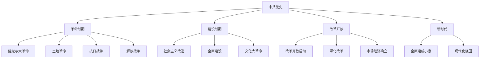

# 中共党史

## 费曼学习法解释

**中共党史是什么？**
中共党史是研究中国共产党从成立到现在的发展历程、重大事件、重要人物及其经验的学科。它不仅是历史记录，更是理解当代中国政治的关键。

**为什么重要？**
- 理解中国政治制度的根源
- 认识中国发展道路的选择
- 总结经验教训指导未来

---

## 知识图谱



---

## 历史分期

### 第一时期：新民主主义革命（1921-1949）

#### 建党与大革命时期（1921-1927）

**重要事件**：
| 时间 | 事件 | 意义 |
|------|------|------|
| 1921.7 | 中共一大 | 中国共产党成立 |
| 1922.7 | 中共二大 | 制定民主革命纲领 |
| 1923 | 中共三大 | 国共合作决定 |
| 1924-1927 | 国民革命 | 北伐战争 |
| 1927.4 | 四一二政变 | 革命失败 |

**关键人物**：
- 陈独秀（首任总书记）
- 李大钊（早期领导人）
- 毛泽东（开始崭露头角）

#### 土地革命时期（1927-1937）

**重要事件**：
```
1927.8 南昌起义 → 武装斗争开始
1927.9 秋收起义 → 农村包围城市起点
1927.10 井冈山根据地 → 中国革命道路探索
1930-1931 反"围剿" → 游击战、运动战
1931.11 中华苏维埃共和国 → 红色政权建立
1934.10-1935.10 长征 → 战略转移
1935.1 遵义会议 → 毛泽东领导地位确立
1936.12 西安事变 → 抗日民族统一战线形成
```

**理论创新**：
- 农村包围城市、武装夺取政权
- 马克思主义中国化开始

#### 抗日战争时期（1937-1945）

**重要事件**：
| 时间 | 事件 | 意义 |
|------|------|------|
| 1937.7 | 七七事变 | 全面抗战开始 |
| 1937.9 | 第二次国共合作 | 抗日民族统一战线 |
| 1938 | 《论持久战》 | 抗战理论指导 |
| 1940 | 百团大战 | 八路军主动出击 |
| 1942-1945 | 延安整风 | 思想统一 |
| 1945.4-6 | 中共七大 | 毛泽东思想确立 |

**历史意义**：
- 中国人民第一次完全胜利的反侵略战争
- 党的力量大发展（从4万→121万党员）

#### 解放战争时期（1945-1949）

**重要事件**：
```
1945.8-10 重庆谈判 → 争取和平
1946.6 内战爆发 → 全面内战开始
1947.6 刘邓大军挺进大别山 → 战略反攻
1948.9-1949.1 三大战役 → 决定胜利
├── 辽沈战役
├── 淮海战役
└── 平津战役
1949.4 渡江战役 → 解放南京
1949.10.1 中华人民共和国成立 → 革命胜利
```

---

### 第二时期：社会主义革命和建设（1949-1978）

#### 社会主义改造时期（1949-1956）

**重要事件**：
| 时间 | 事件 | 内容 |
|------|------|------|
| 1950-1953 | 土地改革 | 废除封建土地制度 |
| 1950-1953 | 抗美援朝 | 保家卫国 |
| 1953-1956 | 三大改造 | 农业手工业资本主义工商业改造 |
| 1954 | 一届全国人大 | 《宪法》制定 |
| 1956 | 中共八大 | 正确路线 |

**成就**：
- 社会主义制度确立
- 工业化初步基础

#### 全面建设社会主义时期（1956-1966）

**探索与曲折**：
```
1958 大跃进 → "左"倾错误
1958 人民公社化运动 → 超越阶段
1959-1961 三年困难时期 → 经济困难
1961-1965 八字方针调整 → 国民经济恢复
```

**经验教训**：
- 社会主义建设规律认识不足
- 急于求成
- 需要实事求是

#### 文化大革命时期（1966-1976）

**历史教训**：
- 严重偏离正确轨道
- 党和国家遭受严重挫折
- 教训深刻

**1976年转折**：
- 周恩来、朱德、毛泽东相继逝世
- 粉碎"四人帮"
- 十年动乱结束

---

### 第三时期：改革开放和社会主义现代化建设（1978-2012）

#### 伟大转折（1978-1992）

**十一届三中全会（1978.12）**：
```
历史意义
├── 思想路线：实事求是
├── 政治路线：以经济建设为中心
├── 组织路线：拨乱反正
└── 改革开放：历史性决策
```

**重要改革**：
| 领域 | 改革内容 |
|------|----------|
| 农村 | 家庭联产承包责任制 |
| 城市 | 企业改革、价格改革 |
| 开放 | 经济特区、沿海开放 |
| 政治 | 民主法制建设 |

**邓小平南方谈话（1992）**：
- 坚持改革开放不动摇
- 市场经济不等于资本主义
- 发展是硬道理

#### 市场经济确立（1992-2002）

**重要事件**：
- 1992：中共十四大 → 建立社会主义市场经济体制
- 1997：中共十五大 → 邓小平理论写入党章
- 2001：加入WTO → 对外开放新阶段

**主要成就**：
- 经济持续高速增长
- 人民生活水平显著提高
- 综合国力大幅增强

#### 科学发展（2002-2012）

**重要理念**：
- 科学发展观
- 以人为本
- 全面协调可持续
- 构建和谐社会

---

### 第四时期：中国特色社会主义新时代（2012- ）

#### 全面建成小康社会（2012-2021）

**重要事件**：
| 时间 | 事件 | 意义 |
|------|------|------|
| 2012.11 | 中共十八大 | 新时代开启 |
| 2017.10 | 中共十九大 | 新思想确立 |
| 2020 | 全面脱贫 | 历史性成就 |
| 2021.7 | 建党百年 | 小康社会建成 |
| 2022.10 | 中共二十大 | 现代化新征程 |

**主要成就**：
- 脱贫攻坚战全面胜利
- 经济总量突破百万亿元
- 全面从严治党成效显著
- 大国外交开创新局面

#### 全面建设社会主义现代化国家（2020- ）

**战略安排**：
```
2020-2035 基本实现社会主义现代化
├── 经济实力大幅跃升
├── 科技自立自强
├── 文化软实力增强
└── 生态环境根本好转

2035-2050 建成社会主义现代化强国
├── 综合国力世界领先
├── 全面实现国家治理现代化
└── 中华民族伟大复兴
```

---

## 重要会议

### 历次全国代表大会

| 大会 | 时间 | 主要贡献 |
|------|------|----------|
| 一大 | 1921 | 党的成立 |
| 二大 | 1922 | 民主革命纲领 |
| 七大 | 1945 | 毛泽东思想 |
| 八大 | 1956 | 社会主义建设 |
| 十一届三中全会 | 1978 | 改革开放 |
| 十四大 | 1992 | 市场经济 |
| 十五大 | 1997 | 邓小平理论 |
| 十六大 | 2002 | "三个代表" |
| 十七大 | 2007 | 科学发展观 |
| 十八大 | 2012 | 新时代 |
| 十九大 | 2017 | 习近平新时代中国特色社会主义思想 |
| 二十大 | 2022 | 中国式现代化 |

---

## 重要理论

### 指导思想发展

```
马克思列宁主义
↓
毛泽东思想（革命与建设）
↓
邓小平理论（改革开放）
↓
"三个代表"重要思想（党的建设）
↓
科学发展观（发展理念）
↓
习近平新时代中国特色社会主义思想（新时代）
```

### 毛泽东思想

**核心内容**：
- 新民主主义革命理论
- 社会主义革命和建设理论
- 军事战略思想
- 党的建设理论

### 邓小平理论

**核心内容**：
- 社会主义本质论
- 社会主义初级阶段论
- 改革开放论
- 一国两制论

### 习近平新时代中国特色社会主义思想

**核心要义**：
- 坚持和发展什么样的中国特色社会主义
- 怎样坚持和发展中国特色社会主义
- 中国式现代化
- 人类命运共同体

---

## 研究方法

### 历史研究法
- 文献分析
- 口述历史
- 档案研究

### 比较研究法
- 中外比较
- 历史比较

### 理论分析法
- 马克思主义历史观
- 实事求是原则

---

## 延伸阅读

- 《中国共产党历史》中共中央党史研究室
- 《中国共产党的九十年》
- 《毛泽东传》
- 《邓小平时代》傅高义
- 《习近平谈治国理政》

---

## 相关词条

- [[马克思主义理论]]
- [[政治学理论]]
- [[中外政治制度]]
- [[国际政治]]
