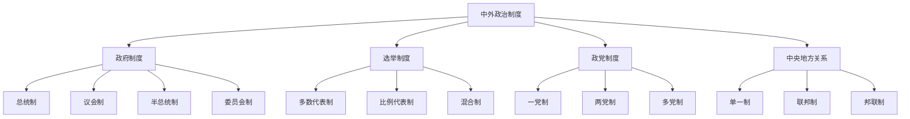

# 中外政治制度

## 费曼学习法解释

**中外政治制度是什么？**
想象不同国家就像不同的"游戏服务器"，每个服务器有不同的规则设置。中外政治制度就是比较研究这些"服务器规则"的学科——研究不同国家如何组织政府、如何选举、如何制衡权力。

**核心问题**：
- 不同国家的政治制度有什么区别？
- 为什么会有这些区别？
- 哪种制度效果更好？

---

## 知识图谱



---

## 核心制度类型

### 1. 政府体制比较

| 类型 | 元首与首脑 | 典型国家 | 优点 | 缺点 |
|------|-----------|----------|------|------|
| 总统制 | 分离（总统=元首+首脑） | 美国 | 分权制衡、稳定 | 可能僵局 |
| 议会制 | 合一（议会多数党领袖为首脑） | 英国 | 效率高、灵活 | 政府不稳定 |
| 半总统制 | 混合（总统+总理） | 法国 | 兼顾效率与制衡 | 权责不清 |
| 委员会制 | 集体领导 | 瑞士 | 民主充分 | 效率较低 |

### 2. 选举制度

**多数代表制（简单多数制）**
```
选区划分 → 单名选区 → 得票最多者当选
优点：政府稳定、极端势力难进入
缺点：代表性不足、浪费选票
典型：英国、美国、印度
```

**比例代表制**
```
选区划分 → 多名选区 → 按得票比例分配席位
优点：代表性强、小党有机会
缺点：政府不稳定、碎片化
典型：荷兰、以色列、瑞典
```

**混合制（德国模式）**
```
一半席位：单名选区（多数代表）
一半席位：政党名单（比例代表）
补偿机制：确保政党席位与得票率匹配
```

### 3. 政党制度

```
政党制度分类
├── 一党制
│   ├── 一党威权制（中国、古巴）
│   └── 一党优势制（日本自民党时期、新加坡）
├── 两党制
│   ├── 交替执政（美国）
│   └── 典型形态（英国）
└── 多党制
    ├── 温和多党制（德国4-5个主要政党）
    └── 极化多党制（以色列10+政党）
```

### 4. 中央与地方关系

| 类型 | 权力分配 | 典型国家 | 特点 |
|------|----------|----------|------|
| 单一制 | 中央集权 | 中国、法国、日本 | 统一高效、地方自主性弱 |
| 联邦制 | 联邦与州分权 | 美国、德国、印度 | 地方自治、协调复杂 |
| 邦联制 | 主权国家联合 | 欧盟 | 松散联合、效率低 |

---

## 主要国家政治制度

### 美国政治制度

```
美国政治制度结构
├── 总统制
│   ├── 总统（4年任期，最多2届）
│   ├── 内阁（总统任命）
│   └── 独立机构
├── 国会（两院制）
│   ├── 参议院（100席，每州2席）
│   └── 众议院（435席，按人口分配）
├── 司法系统
│   ├── 联邦最高法院（9名大法官）
│   └── 联邦法院
└── 联邦制（50州）
    ├── 州政府
    └── 地方政府
```

**三权分立特点**：
- 严格的权力制衡
- 司法审查制度
- 联邦与州双重主权

### 英国政治制度

```
英国政治制度结构
├── 君主立宪制
│   ├── 国王（象征性元首）
│   └── 首相（实际掌权者）
├── 议会（威斯敏斯特体系）
│   ├── 上议院（贵族院）
│   └── 下议院（平民院，650席）
├── 内阁政府
│   ├── 首相
│   └── 大臣
└── 单一制
    ├── 英格兰、苏格兰、威尔士、北爱尔兰
    └── 地方议会（分权改革后）
```

**威斯敏斯特体系特点**：
- 议会至上
- 责任内阁制
- 反对党领袖制度
- 不成文宪法

### 法国政治制度

```
第五共和国政治制度（半总统制）
├── 总统（7年→5年任期）
│   ├── 外交、国防主导权
│   ├── 解散国民议会权
│   └── 任命总理
├── 总理
│   ├── 内政主导权
│   ├── 领导政府工作
│   └── 对议会负责
├── 议会（两院制）
│   ├── 国民议会（577席）
│   └── 参议院（348席）
└── 半总统制特点
    ├── 总统与总理"左右共治"
    └── 双首长制
```

### 德国政治制度

```
德国政治制度（议会制联邦）
├── 联邦总统（象征性）
├── 联邦总理（实权首脑）
│   └── 由联邦议院选举产生
├── 联邦议会（两院制）
│   ├── 联邦议院（Bundestag，598+席）
│   └── 联邦参议院（Bundesrat，69席）
├── 联邦宪法法院
└── 联邦制（16州）
    └── 州享有广泛自治权
```

**特点**：
- 建设性不信任投票
- 联邦参议院代表州利益
- 宪法法院地位崇高

### 日本政治制度

```
日本政治制度（议会制）
├── 天皇（象征性元首）
├── 内阁
│   ├── 首相（国会提名）
│   └── 大臣（半数以上为议员）
├── 国会（两院制）
│   ├── 众议院（465席，4年）
│   └── 参议院（245席，6年）
└── 单一制（47都道府县）
```

**特点**：
- 1955体制（自民党长期执政）
- 官僚主导
- 派阀政治

---

## 中国政治制度

### 人民代表大会制度

```
中国政治制度结构
├── 全国人民代表大会（最高权力机关）
│   ├── 全国人大常委会
│   └── 专门委员会
├── 国家主席（国家元首）
├── 国务院（中央人民政府）
│   └── 各部委
├── 中央军事委员会
├── 国家监察委员会
├── 最高人民法院
├── 最高人民检察院
└── 地方各级人大和政府
```

**特点**：
- 议行合一
- 民主集中制
- 中国共产党领导
- 协商民主（政协制度）

### 多党合作与政治协商制度

| 特点 | 说明 |
|------|------|
| 执政党 | 中国共产党 |
| 参政党 | 8个民主党派 |
| 政协 | 政治协商、民主监督、参政议政 |

---

## 制度比较视角

### 民主质量评估

**评估维度**：
1. **选举质量** - 自由、公平、竞争性
2. **参与程度** - 投票率、政治参与
3. **法治水平** - 司法独立、人权保障
4. **回应性** - 政府对民意的响应
5. **问责制** - 权力的制约与监督

### 制度绩效比较

| 指标 | 总统制 | 议会制 | 半总统制 |
|------|--------|--------|----------|
| 政府稳定性 | 高 | 中-低 | 中 |
| 决策效率 | 低 | 高 | 中 |
| 代表性 | 低 | 高 | 高 |
| 权责清晰度 | 高 | 高 | 低 |

---

## 研究方法

### 比较方法
- **最相似系统设计**（MSSD）- 控制相似，比较差异
- **最不同系统设计**（MDSD）- 寻找共同因素
- **定性比较分析**（QCA）

### 案例研究
- 单案例深度分析
- 多案例比较

---

## 延伸阅读

- 《比较政治制度》曹沛霖
- 《民主的模式》阿伦德·利普哈特
- 《总统制与议会制》胡安·林茨
- 《比较政府与政治》罗德·黑格

---

## 相关词条

- [[政治学理论]]
- [[宪法学]]
- [[国际政治]]
- [[马克思主义理论]]
