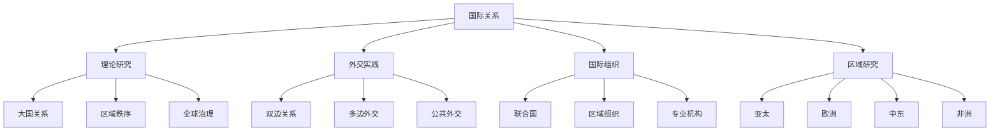

# 国际关系

## 费曼学习法解释

**国际关系是什么？**
国际关系研究国家之间、国际组织之间、以及非国家行为体之间的互动关系。它既包括理论分析（为什么会这样），也包括实践研究（如何处理关系）。

**与国际政治的区别**：
- 国际政治：侧重理论和权力分析
- 国际关系：范围更广，包括外交、国际法、国际组织等

---

## 知识图谱



---

## 核心议题

### 1. 大国关系

**中美关系**：
```
定位：21世纪最重要的双边关系
├── 合作领域
│   ├── 气候变化
│   ├── 公共卫生
│   └── 核不扩散
├── 竞争领域
│   ├── 科技
│   ├── 贸易
│   └── 军事
└── 管控机制
    ├── 高层对话
    └── 危机管控
```

**中俄关系**：
- 全面战略协作伙伴关系
- 能源合作
- 军事技术合作
- 国际事务协调

**美俄关系**：
- 战略竞争为主
- 军控谈判
- 乌克兰问题
- 网络安全

### 2. 区域秩序

| 区域 | 主要矛盾 | 机制建设 |
|------|----------|----------|
| 亚太 | 中美竞争、朝核问题 | 东盟、APEC |
| 欧洲 | 俄乌冲突、北约东扩 | 欧盟、北约 |
| 中东 | 巴以冲突、伊朗问题 | 阿盟、海湾合作委员会 |
| 非洲 | 发展与稳定 | 非盟 |

### 3. 全球性问题

**气候变化**：
- 巴黎协定
- 碳中和目标
- 气候融资

**公共卫生**：
- WHO改革
- 疫苗分配
- 大流行预警

**网络安全**：
- 网络空间规则
- 数据安全
- 跨国犯罪

---

## 国际关系史

### 近代国际关系

```
1648 威斯特伐利亚和约 → 主权国家体系
1815 维也纳会议 → 均势体系
1919 凡尔赛条约 → 国际联盟
1945 雅尔塔体系 → 联合国+冷战
1991 冷战结束 → 美国单极
2008- 多极化 → 新兴大国崛起
```

### 冷战时期的国际关系

**两极格局**：
- 美苏对抗
- 北约vs华约
- 第三世界不结盟运动

**重大事件**：
- 柏林危机（1948-1961）
- 朝鲜战争（1950-1953）
- 古巴导弹危机（1962）
- 越南战争（1964-1975）
- 苏联解体（1991）

### 冷战后国际关系

**特点**：
- 美国霸权
- 全球化加速
- 恐怖主义威胁
- 多极化趋势

**重大事件**：
- 海湾战争（1991）
- 911事件与反恐战争（2001）
- 金融危机（2008）
- 乌克兰危机（2014-）
- 新冠疫情（2020-）

---

## 国际行为体

### 主权国家

**国家要素**：
- 领土
- 人口
- 政府
- 主权（外交承认）

### 国际组织

**政府间组织（IGOs）**：
| 类型 | 例子 |
|------|------|
| 全球性 | 联合国、世界银行、IMF |
| 区域性 | 欧盟、东盟、非盟 |
| 专门性 | OPEC、WHO、WTO |

**非政府组织（NGOs）**：
- 国际红十字会
- 大赦国际
- 绿色和平组织

### 跨国公司

**影响**：
- 经济影响力
- 游说能力
- 供应链政治

### 个人

**作用**：
- 国家领导人
- 国际活动家
- 意见领袖

---

## 外交形式

### 双边外交

**特点**：
- 直接沟通
- 灵活性强
- 保密性好

**工具**：
- 大使与使馆
- 高层互访
- 联合声明

### 多边外交

**形式**：
- 国际会议
- 国际组织
- 条约谈判

**特点**：
- 效率低
- 合法性高
- 规则约束

### 公共外交

**手段**：
- 媒体传播
- 文化交流
- 教育合作

**目的**：
- 提升国家形象
- 影响外国公众舆论
- 软实力投射

### 数字外交

**新形式**：
- 社交媒体外交
- 网络舆论战
- 数字治国术

---

## 国际关系研究方法

### 层次分析法

```
分析层次
├── 体系层次
│   └── 国际结构、国际规范
├── 国家层次
│   └── 政治制度、国内政治
└── 个人层次
    └── 领导人个性、认知
```

### 案例研究

- 单案例深度分析
- 比较案例研究
- 过程追踪

### 定量分析

- 事件数据
- 统计分析
- 大数据方法

---

## 当代国际关系特点

### 多极化

```
力量中心
├── 美国（守成大国）
├── 中国（新兴大国）
├── 欧盟
├── 俄罗斯
├── 印度
└── 其他新兴经济体
```

### 相互依赖

**特点**：
- 经济全球化
- 供应链网络
- 人员流动
- 信息互联

**问题**：
- 相互依赖武器化
- 脱钩与去风险
- 供应链安全

### 非传统安全

| 领域 | 威胁 | 应对 |
|------|------|------|
| 经济 | 金融危机 | G20协调 |
| 环境 | 气候变化 | 国际协议 |
| 公共卫生 | 大流行 | WHO |
| 网络 | 攻击、犯罪 | 国际规范 |
| 恐怖主义 | 跨国恐怖组织 | 情报共享 |

---

## 中国与当代国际关系

### 中国外交理念

- 和平发展
- 合作共赢
- 人类命运共同体
- 新型国际关系

### 主要倡议

| 倡议 | 内容 | 进展 |
|------|------|------|
| 一带一路 | 基础设施、贸易联通 | 150+国家参与 |
| 全球发展倡议 | 发展合作 | 落实中 |
| 全球安全倡议 | 安全合作 | 框架建立 |
| 全球文明倡议 | 文明交流 | 推进中 |

### 国际角色定位

- 发展中国家
- 负责任大国
- 现有秩序的维护者与改革者

---

## 延伸阅读

- 《国际关系分析》詹姆斯·多尔蒂
- 《理解全球冲突与合作》约瑟夫·奈
- 《国际关系史》袁明
- 《中国外交》杨洁勉

---

## 相关词条

- [[国际政治]]
- [[外交学]]
- [[中外政治制度]]
- [[政治学理论]]
