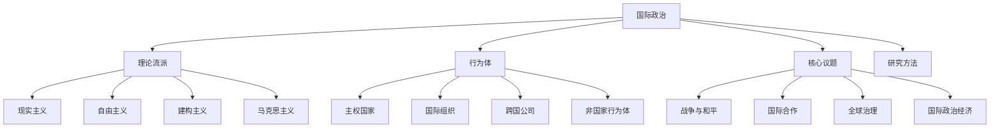

# 国际政治

## 费曼学习法解释

**国际政治是什么？**
想象世界是一个没有"世界政府"的小区，每个国家就像一户人家。国际政治研究的就是这些"人家"之间如何相处、如何争夺利益、如何避免冲突。

**核心问题**：
- 没有世界政府，国际秩序如何可能？
- 国家为什么打仗？为什么合作？
- 权力、利益、观念如何影响国际关系？

---

## 知识图谱



---

## 核心理论流派

### 1. 现实主义

**核心假设**：
```
1. 无政府状态 → 没有世界政府
2. 国家是主要行为体
3. 国家是理性行为体
4. 生存是首要目标
5. 权力是核心追求
```

**分支**：
| 流派 | 代表人物 | 核心观点 |
|------|----------|----------|
| 古典现实主义 | 摩根索 | 人性本恶，权力追求 |
| 结构现实主义 | 沃尔兹 | 无政府结构决定国家行为 |
| 进攻性现实主义 | 米尔斯海默 | 大国必然争霸 |
| 防御性现实主义 | 沃尔特 | 安全困境，追求安全而非权力 |
| 新古典现实主义 | 各学者 | 国内政治影响对外政策 |

### 2. 自由主义

**核心假设**：
```
1. 国际合作是可能的
2. 制度可以改变国家行为
3. 相互依赖促进和平
4. 民主国家不打仗（民主和平论）
```

**分支**：
- **制度自由主义**：国际组织促进合作
- **商业自由主义**：经济相互依赖减少冲突
- **共和自由主义**：民主制度带来和平

### 3. 建构主义

**核心观点**：
```
无政府状态是国家造就的（温特）
→ 观念塑造利益
→ 身份认同决定行为
→ 国际规范可以改变国家行为
```

**三种无政府文化**：
- 霍布斯文化（敌对）
- 洛克文化（竞争）
- 康德文化（友谊）

### 4. 其他理论

| 理论 | 核心观点 |
|------|----------|
| 英国学派 | 国际社会理论 |
| 批判理论 | 解放、正义 |
| 女性主义 | 性别视角 |
| 后殖民主义 | 反西方中心 |

---

## 核心概念

### 1. 无政府状态

```
无政府状态 ≠ 混乱
↓
指缺乏中央权威
↓
自助体系：国家必须自己保护自己
```

### 2. 权力

**硬权力**：
- 军事力量
- 经济实力
- 人口、领土

**软权力**（约瑟夫·奈）：
- 文化吸引力
- 政治价值观
- 外交政策合法性

**巧权力**：
- 硬权力与软权力的结合运用

### 3. 国家利益

```
国家利益层次
├── 核心利益（生死存亡）
│   ├── 主权独立
│   ├── 领土完整
│   └── 政权安全
├── 重要利益（重大影响）
│   ├── 经济发展
│   └── 地区影响力
└── 次要利益（一般利益）
    └── 具体议题
```

### 4. 均势与霸权

| 概念 | 定义 | 例子 |
|------|------|------|
| 均势 | 大国力量大致平衡 | 维也纳体系 |
| 霸权 | 一国主导地位 | 冷战后美国 |
| 霸权稳定论 | 霸权国提供公共产品 | 美国提供安全保护伞 |
| 权力转移 | 新兴大国挑战霸权 | 一战前德国vs英国 |

### 5. 安全困境

```
国家A增强军力 → 国家B感到威胁 → 国家B增强军力
↑_____________________________________________|
                    军备竞赛螺旋上升
```

**缓解方式**：
- 建立信任措施
- 军控条约
- 集体安全

---

## 国际体系演变

### 历史演变

```
威斯特伐利亚体系（1648）
↓
维也纳体系（1815）
↓
凡尔赛-华盛顿体系（1919）
↓
雅尔塔体系（1945）- 冷战两极
↓
后冷战体系（1991-）- 美国单极
↓
多极化趋势（当前）- 中美竞争
```

### 冷战后国际格局

| 视角 | 描述 |
|------|------|
| 单极时刻 | 美国霸权（1991-2008） |
| 一超多强 | 美国+欧盟、中国、俄罗斯、日本 |
| 多极化 | 多个力量中心形成 |
| 无极世界 | 权力分散化 |

---

## 核心议题

### 1. 战争与和平

**战争原因**：
- 修昔底德陷阱（新兴大国vs守成大国）
- 民族主义与领土争端
- 资源争夺
- 意识形态冲突
- 误判与意外

**和平条件**：
- 民主和平论
- 商业和平论
- 制度和平论
- 核威慑

### 2. 国际合作

**合作障碍**：
```
囚徒困境
├── 不信任
├── 相对收益考量
└── 欺骗风险
```

**合作机制**：
- 国际制度
- 重复博弈（声誉）
- 第三方监督

### 3. 全球治理

| 领域 | 主要机制 |
|------|----------|
| 安全 | 联合国安理会 |
| 经济 | IMF、世界银行、WTO |
| 气候 | 巴黎协定、COP会议 |
| 公共卫生 | WHO |

### 4. 国际政治经济（IPE）

**核心争论**：
- 自由主义：自由贸易带来共赢
- 现实主义：经济是权力的工具
- 马克思主义：国际分工是剥削

---

## 主要国际组织

### 联合国

```
联合国体系
├── 大会（所有会员国）
├── 安全理事会
│   ├── 常任理事国（5个，否决权）
│   └── 非常任理事国（10个）
├── 秘书处
│   └── 秘书长
├── 经济及社会理事会
├── 国际法院
└── 专门机构
    ├── 世界银行
    ├── 国际货币基金组织
    └── 世界卫生组织等
```

### 其他重要组织

| 组织 | 性质 | 成员 | 功能 |
|------|------|------|------|
| 北约 | 军事联盟 | 31国 | 集体防御 |
| 欧盟 | 区域一体化 | 27国 | 政经联盟 |
| 东盟 | 区域组织 | 10国 | 区域合作 |
| 金砖国家 | 新兴经济体 | 5→10国 | 经济合作 |

---

## 中国外交

### 基本原则

- 独立自主和平外交
- 不结盟政策
- 和平共处五项原则
- 人类命运共同体

### 大国关系

| 关系 | 定位 | 特点 |
|------|------|------|
| 中美 | 竞争与合作 | 战略竞争主导 |
| 中俄 | 全面战略协作伙伴 | 高度互信 |
| 中欧 | 全面战略伙伴 | 经贸为主 |
| 中日 | 战略互惠关系 | 复杂敏感 |

---

## 研究方法

### 定量方法
- 事件数据分析
- 相关性研究
- 大样本统计

### 定性方法
- 案例研究
- 历史分析
- 比较分析

### 博弈论
- 囚徒困境
- 胆小鬼博弈
- 鹰鸽博弈

---

## 延伸阅读

- 《国家间政治》摩根索
- 《国际政治理论》沃尔兹
- 《国际政治的社会理论》温特
- 《大国政治的悲剧》米尔斯海默

---

## 相关词条

- [[国际关系]]
- [[外交学]]
- [[政治学理论]]
- [[中外政治制度]]
