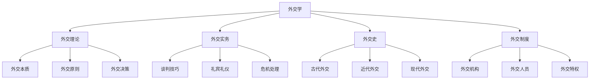

# 外交学

## 费曼学习法解释

**外交学是什么？**
外交学是研究国家如何通过谈判、沟通、协商等和平手段处理对外关系的学科。如果说国际关系是研究"为什么"，外交学则更关注"怎么做"——如何在复杂的国际环境中实现国家利益。

**核心问题**：
- 如何与外国打交道？
- 如何通过谈判解决问题？
- 如何维护和促进国家利益？

---

## 知识图谱



---

## 外交本质与功能

### 外交的定义

**经典定义**：
> 外交是主权国家通过官方代表，使用和平手段处理国家间关系的艺术和科学。

**核心要素**：
- 主体：主权国家
- 客体：国家间关系
- 手段：和平方式（谈判、协商）
- 目的：维护和促进国家利益

### 外交的功能

| 功能 | 说明 | 例子 |
|------|------|------|
| 代表 | 代表国家与他国交往 | 大使递交国书 |
| 观察 | 收集信息、分析形势 | 使馆调研报告 |
| 谈判 | 通过对话解决分歧 | 贸易谈判 |
| 保护 | 保护本国公民和利益 | 撤侨行动 |
| 促进 | 促进经贸文化交流 | 文化年活动 |

---

## 外交制度

### 外交机构

**中央层面**：
```
外交部
├── 部领导
│   ├── 外交部长
│   └── 副部长
├── 地区司
│   ├── 亚洲司
│   ├── 欧洲司
│   └── ...
├── 功能司
│   ├── 条法司
│   ├── 新闻司
│   └── ...
└── 驻外机构
    ├── 大使馆
    ├── 领事馆
    └── 代表团
```

**驻外机构**：
- **大使馆**：最高级别外交代表机构
- **公使馆**：次高级别（较少见）
- **领事馆**：处理侨务、签证等事务
- **常驻代表团**：派驻国际组织

### 外交官等级

| 等级 | 职位 | 说明 |
|------|------|------|
| 大使 | 馆长 | 最高级别外交代表 |
| 公使 | 副馆长 | 大使馆二把手 |
| 参赞 | 各部门负责人 | 政务、商务、文化等 |
| 一等秘书 | 中高级外交官 | - |
| 二等秘书 | 中级外交官 | - |
| 三等秘书 | 初级外交官 | - |
| 随员 | 最低级别 | 入门级 |

### 外交特权与豁免

**依据**：《维也纳外交关系公约》（1961）

**主要特权**：
1. **人身不可侵犯** - 不受逮捕或拘留
2. **馆舍不可侵犯** - 使馆不受侵犯
3. **档案不可侵犯** - 外交文件受保护
4. **通讯自由** - 外交信使、密码通讯
5. **税收豁免** - 免纳捐税
6. **司法豁免** - 刑事豁免、民事有限豁免

---

## 外交程序与礼仪

### 建立外交关系

```
建交流程
├── 谈判
│   └── 就建交条件达成一致
├── 公报
│   └── 发表联合公报/声明
├── 互派使节
│   └── 任命大使
└── 到任
    ├── 递交国书
    └── 正式履新
```

### 礼宾礼仪

**位次排列**：
- 按到任日期先后（递交国书日期）
- 圆桌会议不排位次
- 国际会议按字母顺序

**常见礼宾活动**：
| 活动 | 说明 |
|------|------|
| 国宴 | 最高规格招待 |
| 正式宴会 | 规格较高 |
| 工作午餐 | 非正式交流 |
| 招待会 | 大型社交活动 |

### 外交文书

**类型**：
- **国书**：国家元首致接受国元首的信函
- **照会**：最常用的外交文书
- **备忘录**：详细说明立场
- **联合声明/公报**：双方共识
- **条约**：正式国际协议

---

## 外交谈判

### 谈判原则

1. **国家利益至上** - 维护核心利益
2. **平等互利** - 双方都有收获
3. **灵活务实** - 寻求可行方案
4. **诚信守约** - 履行承诺

### 谈判策略

**硬谈判**：
- 立场强硬
- 最后通牒
- 威胁施压

**软谈判**：
- 妥协退让
- 维护关系
- 让步换取合作

**原则性谈判**（哈佛谈判法）：
- 对事不对人
- 关注利益而非立场
- 创造双赢方案
- 使用客观标准

### 谈判阶段

```
谈判过程
├── 准备阶段
│   ├── 收集信息
│   ├── 确定目标
│   └── 制定策略
├── 开局阶段
│   ├── 建立氛围
│   └── 陈述立场
├── 实质阶段
│   ├── 讨价还价
│   └── 缩小分歧
├── 收尾阶段
│   ├── 达成协议
│   └── 签署文件
└── 执行阶段
    └── 履行承诺
```

---

## 外交类型

### 双边外交

**特点**：
- 关系直接
- 灵活性高
- 保密性强

**主要内容**：
- 政治关系
- 经贸合作
- 文化交流
- 安全合作

### 多边外交

**形式**：
- 国际会议
- 国际组织会议
- 区域论坛

**技巧**：
- 联合志同道合国家
- 寻求共识
- 利用规则

### 首脑外交

**特点**：
- 高层直接沟通
- 政治决断力强
- 效率高
- 风险也高

**形式**：
- 国事访问
- 工作访问
- 多边会议
- 热线沟通

### 公共外交

**对象**：外国公众

**手段**：
- 媒体传播
- 文化交流
- 教育合作
- 社交媒体

**目的**：
- 改善国家形象
- 影响舆论
- 软实力投射

### 经济外交

**内容**：
- 贸易谈判
- 投资促进
- 经济援助
- 制裁政策

### 危机外交

**特点**：
- 时间紧迫
- 风险高
- 需要快速反应

**原则**：
- 保持沟通渠道
- 控制升级
- 寻找台阶

---

## 中国外交

### 外交思想

**毛泽东时代**：
- 一边倒（倒向苏联）
- 独立自主
- 三个世界理论

**邓小平时代**：
- 韬光养晦
- 不当头
- 发展优先

**新时代**：
- 大国外交
- 人类命运共同体
- 新型国际关系

### 外交风格

| 特点 | 说明 |
|------|------|
| 不干涉内政 | 尊重各国主权 |
| 合作共赢 | 追求互利 |
| 对话协商 | 和平解决争端 |
| 结伴不结盟 | 伙伴关系网络 |

### 外交实践

**重大成就**：
- 恢复联合国席位（1971）
- 中美建交（1979）
- 香港澳门回归
- 加入WTO（2001）
- 一带一路倡议（2013-）

---

## 外交决策

### 决策模式

**理性决策模式**：
```
问题识别 → 目标确定 → 方案设计 → 方案评估 → 选择执行
```

**组织过程模式**：
- 各部门博弈
- 标准作业程序
- 妥协折中

**政治博弈模式**：
- 国内政治考量
- 利益集团影响
- 领导人个性

### 影响因素

| 因素 | 影响 |
|------|------|
| 国际环境 | 外部压力与机遇 |
| 国内政治 | 政党、舆论、利益集团 |
| 领导人 | 个性、认知、偏好 |
| 历史经验 | 教训与惯性 |

---

## 数字时代的外交

### 新形式

- **数字外交**：社交媒体、网络平台
- **网络外交**：网络安全议题
- **数据外交**：数据治理合作

### 挑战

- 信息传播加速
- 公众参与增加
- 秘密外交空间缩小
- 舆论压力增大

---

## 延伸阅读

- 《外交学概论》鲁毅
- 《外交实践指南》萨道义
- 《论外交》卡莱尔
- 《大外交》基辛格

---

## 相关词条

- [[国际关系]]
- [[国际政治]]
- [[中外政治制度]]
- [[政治学理论]]
