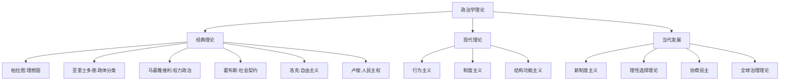

# 政治学理论

## 费曼学习法解释

**政治学理论是什么？**
想象你要设计一个游戏规则，让一群人能够和平共处、共同决策。政治学理论就是研究这些"游戏规则"的学问——它探讨权力如何分配、决策如何做出、社会如何组织。

**核心问题**：
- 谁应该统治？（合法性）
- 如何统治？（政体形式）
- 统治的目的是什么？（正义、自由、秩序）

---

## 知识图谱



---

## 核心概念详解

### 1. 权力与权威

| 概念 | 定义 | 例子 |
|------|------|------|
| 权力 | 强制他人服从的能力 | 军队、警察 |
| 权威 | 被认可的合法权力 | 民选政府 |
| 暴力 | 不合法的强制手段 | 政变、叛乱 |

**韦伯的三种权威类型**：
- 传统型权威（世袭制）
- 魅力型权威（革命领袖）
- 法理型权威（现代官僚制）

### 2. 政体形式

```
政体分类（亚里士多德）
├── 一人统治
│   ├── 君主制（良性）
│   └── 僭主制（恶性）
├── 少数人统治
│   ├── 贵族制（良性）
│   └── 寡头制（恶性）
└── 多数人统治
    ├── 共和制（良性）
    └── 民主制（恶性：暴民政治）
```

### 3. 政治合法性

**来源**：
1. **绩效合法性** - 政府治理效果好
2. **程序合法性** - 通过合法程序产生
3. **意识形态合法性** - 基于共同价值
4. **传统合法性** - 历史延续性

### 4. 社会契约论

| 思想家 | 自然状态 | 契约内容 | 结果 |
|--------|----------|----------|------|
| 霍布斯 | 人对人如狼 | 让渡所有权利 | 绝对主义国家 |
| 洛克 | 相对和平 | 让渡部分权利 | 有限政府 |
| 卢梭 | 自由平等 | 公意统治 | 人民主权 |

---

## 主要理论流派

### 古典政治学
- **柏拉图**：《理想国》- 哲学家王
- **亚里士多德**：《政治学》- 政体分类学
- **西塞罗**：共和主义

### 近代政治学
- **马基雅维利**：现实主义政治
- **霍布斯/洛克/卢梭**：社会契约论
- **孟德斯鸠**：三权分立

### 现代政治学
- **行为主义**：实证研究方法
- **制度主义**：制度的作用
- **结构功能主义**：政治系统分析

### 当代政治学
- **新制度主义**：制度的回归
- **理性选择理论**：经济学方法应用
- **协商民主**：民主的新形式

---

## 研究方法

### 规范研究
- 价值判断
- "应该是什么"
- 哲学思辨

### 实证研究
- 事实描述
- "是什么"
- 经验验证

### 比较研究
- 跨国比较
- 历史比较
- 案例分析

---

## 中国语境下的政治学理论

### 中国传统政治思想
- 儒家：德治、仁政
- 法家：法治、权术
- 道家：无为而治
- 墨家：兼爱、非攻

### 当代中国政治学发展
- 马克思主义政治学中国化
- 国家治理现代化研究
- 中国特色社会主义政治发展道路

---

## 应用场景

1. **宪政设计** - 如何设计宪法制度
2. **民主转型** - 从威权到民主的路径
3. **国家建构** - 如何建立有效国家
4. **冲突解决** - 政治分歧的化解
5. **治理创新** - 政府治理方式改革

---

## 延伸阅读

- 《政治学》亚里士多德
- 《君主论》马基雅维利
- 《利维坦》霍布斯
- 《政府论》洛克
- 《社会契约论》卢梭
- 《论美国的民主》托克维尔
- 《政治学原理》王惠岩

---

## 相关词条

- [[法学理论]]
- [[宪法学]]
- [[国际关系]]
- [[中共党史]]
- [[马克思主义理论]]
