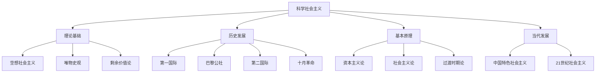

# 科学社会主义与国际共产主义运动

## 费曼学习法解释

**科学社会主义是什么？**
科学社会主义是马克思主义的重要组成部分，是关于无产阶级解放条件和人类社会发展规律的学说。它从"空想"变成"科学"，因为它找到了实现理想社会的现实力量（工人阶级）和科学方法（革命实践）。

**核心问题**：
- 资本主义为什么必然灭亡？
- 社会主义如何从理想变为现实？
- 无产阶级如何获得解放？

---

## 知识图谱



---

## 从空想到科学

### 空想社会主义

**三个阶段**：

| 时期 | 代表人物 | 主要思想 |
|------|----------|----------|
| 16-17世纪 | 莫尔《乌托邦》 | 理想社会设想 |
| 18世纪 | 摩莱利、马布利 | 法治社会主义 |
| 19世纪初 | 圣西门、傅立叶、欧文 | 批判资本主义、设计理想社会 |

**局限**：
- 没有找到实现理想的力量
- 寄希望于富人发善心
- 脱离现实条件

**贡献**：
- 批判了资本主义弊端
- 设想了未来社会蓝图

### 科学社会主义的创立

**三大来源**：
```
德国古典哲学 → 唯物史观
英国古典政治经济学 → 剩余价值论
法国空想社会主义 → 科学社会主义
```

**两大发现**：
1. **唯物史观** - 社会存在决定社会意识，生产力与生产关系的矛盾推动社会发展
2. **剩余价值论** - 揭示资本主义剥削秘密

**创立标志**：
- 《共产党宣言》（1848）发表

---

## 基本原理

### 资本主义基本矛盾

```
生产社会化 vs 生产资料私有制
↓
矛盾表现
├── 个别企业有组织 vs 整个社会无政府
├── 生产无限扩大 vs 劳动人民购买力相对缩小
└── 生产力发展 vs 生产关系阻碍
↓
经济危机
↓
资本主义必然灭亡
```

### 无产阶级历史使命

**原因**：
- 最先进的阶级（与大工业相联系）
- 最革命的阶级（受剥削最深）
- 最有组织性的阶级（集体劳动）

**使命**：
- 推翻资产阶级统治
- 建立无产阶级专政
- 建设社会主义和共产主义

### 社会主义革命

**条件**：
- 客观条件：资本主义矛盾激化
- 主观条件：无产阶级成熟、党的领导

**道路**：
- 暴力革命（经典形式）
- 和平过渡（特定条件下）

**领导力量**：
- 无产阶级政党（共产党）
- 先锋队性质
- 民主集中制原则

### 无产阶级专政

**本质**：
- 新型民主（对人民民主）
- 新型专政（对敌人专政）
- 过渡性国家

**形式**：
- 巴黎公社式
- 苏维埃式
- 人民代表大会式

### 社会主义特征

**基本特征**：
1. 生产资料公有制
2. 按劳分配
3. 计划经济（经典理论）
4. 无产阶级专政
5. 共产党领导

**发展阶段**：
```
社会主义（第一阶段）
├── 生产力还不够发达
├── 按劳分配
└── 阶级差别存在

共产主义（高级阶段）
├── 生产力高度发达
├── 按需分配
└── 三大差别消灭
```

---

## 国际共产主义运动史

### 第一国际（1864-1876）

**正式名称**：国际工人协会

**主要活动**：
- 促进各国工人团结
- 支持民族解放运动
- 传播马克思主义

**历史意义**：
- 马克思主义开始与工人运动结合

### 巴黎公社（1871）

**世界第一个无产阶级政权**

**革命措施**：
| 领域 | 措施 |
|------|------|
| 政治上 | 普选制、撤换制、低薪制 |
| 经济上 | 没收逃亡资本家工厂 |
| 军事上 | 国民自卫军取代常备军 |

**经验教训**：
- 没有建立坚强领导核心
- 没有及时进攻凡尔赛
- 没有没收法兰西银行

**意义**：
- 无产阶级专政的第一次尝试
- 马克思总结公社经验

### 第二国际（1889-1914）

**特点**：
- 各国社会民主党联合组织
- 议会斗争为主
- 后期出现修正主义

**主要成就**：
- 争取普选权
- 八小时工作制
- 五一国际劳动节

**分裂**：
- 伯恩施坦修正主义
- 一战爆发后解散

### 俄国十月革命（1917）

**意义**：
- 第一次成功的社会主义革命
- 建立第一个社会主义国家
- 开辟人类历史新纪元

**布尔什维克经验**：
- 坚强的党的领导
- 工农联盟
- 武装斗争
- 苏维埃政权形式

### 第三国际（共产国际）（1919-1943）

**特点**：
- 列宁领导建立
- 高度集中的组织形式
- 推动世界革命

**贡献**：
- 帮助各国建立共产党
- 传播列宁主义
- 支持民族解放运动

### 社会主义阵营（1945-1991）

**二战后扩张**：
```
社会主义国家
├── 苏联
├── 东欧八国
│   ├── 波兰、匈牙利、捷克斯洛伐克
│   ├── 民主德国、罗马尼亚、保加利亚
│   ├── 南斯拉夫、阿尔巴尼亚
├── 亚洲
│   ├── 中国、朝鲜、越南、老挝
│   └── 蒙古
├── 拉丁美洲：古巴
└── 非洲（短期）
```

**苏联模式**：
- 高度集中的计划经济
- 一党执政
- 优先发展重工业

### 苏东剧变（1989-1991）

**原因**：
- 经济体制僵化
- 政治体制弊端
- 戈尔巴乔夫改革失败
- 西方和平演变

**教训**：
- 必须坚持改革
- 必须发展生产力
- 必须保持党的先进性
- 必须独立自主

---

## 中国特色社会主义

### 发展历程

**毛泽东时代**：
- 社会主义改造
- 探索社会主义建设道路
- 成就与曲折

**邓小平时代**：
- 改革开放
- 中国特色社会主义理论
- 市场经济探索

**新时代**：
- 习近平新时代中国特色社会主义思想
- 中国式现代化
- 高质量发展

### 中国特色社会主义道路

**与苏联模式的区别**：
| 方面 | 苏联模式 | 中国特色 |
|------|----------|----------|
| 经济 | 纯粹计划经济 | 社会主义市场经济 |
| 所有制 | 单一公有制 | 公有制为主体、多种所有制 |
| 分配 | 单一按劳分配 | 按劳为主、多种方式 |

**本质特征**：
- 中国共产党领导
- 以人民为中心
- 共同富裕
- 改革开放

### 理论成果

```
中国特色社会主义理论体系
├── 邓小平理论
├── "三个代表"重要思想
├── 科学发展观
└── 习近平新时代中国特色社会主义思想
```

---

## 当代发展

### 21世纪社会主义

**特点**：
- 多样化发展
- 与本国实际结合
- 与时俱进

**主要国家**：
- 中国（中国特色社会主义）
- 越南（革新开放）
- 古巴（社会主义模式更新）
- 朝鲜（主体思想）
- 老挝

### 资本主义新变化

**表现**：
- 国家垄断资本主义
- 福利国家制度
- 股份制普及
- 全球化

**本质未变**：
- 剩余价值规律仍起作用
- 基本矛盾依然存在
- 两极分化加剧

### 面临的问题

**理论层面**：
- 社会主义发展阶段
- 市场与计划关系
- 民主与效率平衡

**实践层面**：
- 生产力发展
- 共同富裕实现
- 执政党建设
- 国际环境

---

## 研究方法

### 方法论

- 辩证唯物主义
- 历史唯物主义
- 理论与实践结合

### 研究领域

- 社会主义思想史
- 国际共产主义运动史
- 当代世界社会主义
- 中国特色社会主义

---

## 延伸阅读

- 《共产党宣言》马克思、恩格斯
- 《社会主义从空想到科学的发展》恩格斯
- 《国家与革命》列宁
- 《论十大关系》毛泽东
- 《建设有中国特色的社会主义》邓小平

---

## 相关词条

- [[马克思主义理论]]
- [[政治学理论]]
- [[中共党史]]
- [[中外政治制度]]
